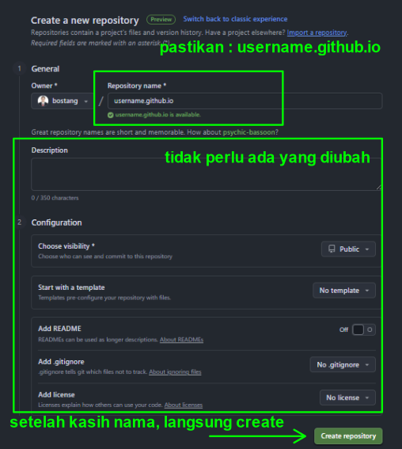
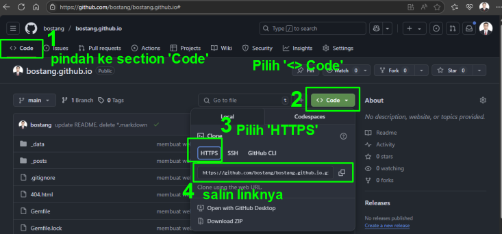
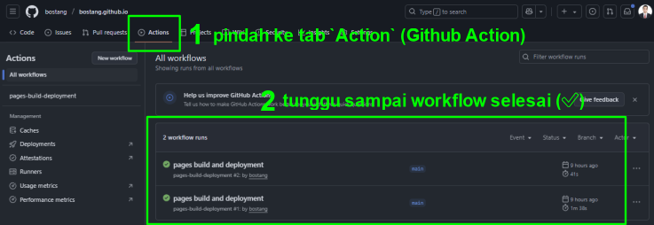
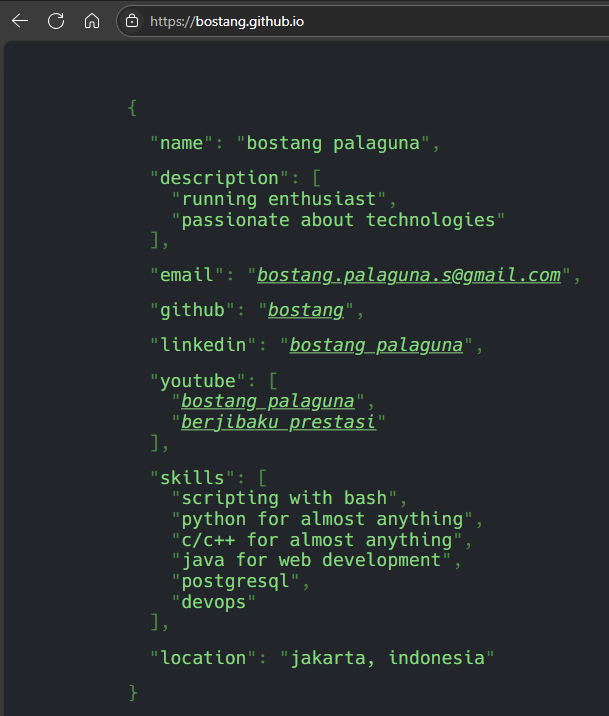

# bostang.github.io

Personal Website of Bostang Palaguna

> Created from [hacked-jekyll](https://jamstackthemes.dev/theme/jekyll-hacked/).

## Cara Menerapkan Website Ini

_~Jika kamu ingin menirunya juga (\^\_\^)_

**Langkah 0** : Install [Ruby](http://rubyinstaller.org/downloads/)

**Langkah 1** : Install `bundler` dan `jekyll`

```bash
gem install bundler
gem install bundler
```

**Langkah 2** : Buat template Jekyll site

```bash
# Buat folder dan template proyek
jekyll new my-portfolio-site

# pindah ke folder itu
cd my-portfolio-site
```

**Langkah 3** : Modifikasi `Gemfile`

```ruby
source "https://rubygems.org"
# Hello! This is where you manage which Jekyll version is used to run.
gem "jekyll", "~> 3.9"
gem "logger"
gem "base64"
gem "bigdecimal"
gem "fiddle"
gem "sass-embedded", "~> 1.89"

# If you have any plugins, put them here!
group :jekyll_plugins do
  gem "jekyll-feed"
  gem "jekyll-sitemap"
  gem "jekyll-remote-theme" # for github page hosting
end

# Windows and JRuby does not include zoneinfo files, so bundle the tzinfo-data gem
# and associated library.
platforms :mingw, :x64_mingw, :mswin, :jruby do
  gem "tzinfo", ">= 1", "< 3"
  gem "tzinfo-data"
end

# Performance-booster for watching directories on Windows
gem "wdm", "~> 0.1", :platforms => [:mingw, :x64_mingw, :mswin]

# Lock `http_parser.rb` gem to `v0.6.x` on JRuby builds since newer versions of the gem
# do not have a Java counterpart.
gem "http_parser.rb", "~> 0.6.0", :platforms => [:jruby]
```

**Langkah 4** : Modifikasi `_config.yml`

```yml
# This config file is meant for settings that affect your whole blog, values
# which you are expected to set up once and rarely edit after that. If you find
# yourself editing this file very often, consider using Jekyll's data files
# feature for the data you need to update frequently.

title: <<masukkan JUDUL di sini>>
email: <<masukkan EMAIL di sini>>
description: >- # this means to ignore newlines until "baseurl:"
  <<masukkan DESKRIPSI di sini>>.
baseurl: "" # the subpath of your site, e.g. /blog
url: "" # the base hostname & protocol for your site, e.g. http://example.com
twitter_username: <<masukkan USERNAME TWITTER di sini>>
github_username:  <<masukkan USERNAME GITHUB di sini>>

# Build settings
remote_theme: piazzai/hacked-jekyll # for github page hosting
plugins:
  - jekyll-feed
  - jekyll-sitemap
  - jekyll-remote-theme # for github page hosting

```

**Langkah 5** : Buat folder `_data` dan buat file `json.yml` di dalamnya

```yml
- key: Name
  value: <<YOUR NAME>>

- key: Description
  value:
    - <<DESCRIPTION 1>>
    - <<DESCRIPTION 2>>

- key: Email
  value: <<EMAIL>>
  url: mailto:<<EMAIL>>

- key: GitHub
  value: <<USERNAME GITHUB>>
  url: <<URL GITHUB>>

- key: <<Key>>          # bisa bebas membuat key sendiri
  value: <<Value>>      # bisa bebas membuat value sendiri
  url: <<URL>>

- key: Youtube
  value:
    - value: <<Value 1>>
      url: <<URL 2>>
    - value: <<Value 2>>
      url: <<URL 1>>

- key: Skills
  value:
    - <<SKILL 1>>
    - <<SKILL 2>>
    
- key: Location
  value: <<CITY>>, <<COUNTRY>>
```

**Langkah 6** : Buat repository kosong di Github _remote_

> pastikan nama repository-nya adalah `username.github.io` (contoh : `bostang.github.io`)



**Langkah 7** : Buat menjadi `git` repository dan push ke `Github Page`



```bash
# Inisisasi folder lokal sebagai git repository
git init

# Tambahkan semua file di dalam folder ini ke dalam repo (tracking)
git add .

# Commit perubahan
git commit -m "Membuat sebuah website portfolio sederhana dengan templpate Hacked Jekyll"

# Ubah nama branch sekarang menjadi main
git branch -M main

# hubungkan dengan repository remote di Github
git remote add origin https://github.com/YOUR_USERNAME/YOUR_REPOSITORY_NAME.git

# Push repo local ke remote (Github)
git push -u origin main
```

**Langkah 8** : Tunggu sampai proses _render_ (_build_) dan _deploy_ selesai di Github Action



**Langkah 9** : akses url `username.github.io` untuk melihat hasilnya



**Catatan**:

1. Pastikan Github repo bersifat `public` agar Github Page dapat di-_render_ dan ter-_deploy_.
